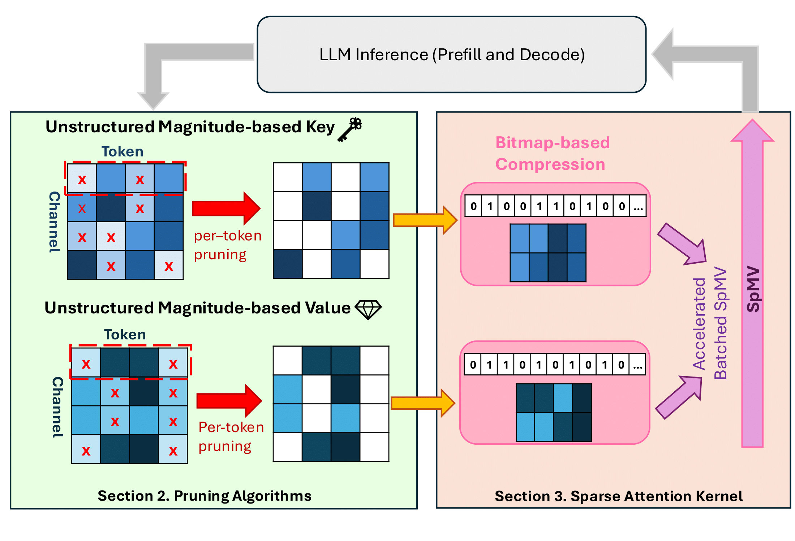

# Mustafar: Promoting Unstructured Sparsity for KV Cache Pruning in LLM Inference


<p align="center">
  
</p>

Lord Vader approves of unstructured sparsity in KV cache. 
[Paper](https://www.arxiv.org/pdf/2505.22913)

---

## 📋 Table of Contents

1. [Overview](#overview)  
2. [Prerequisites](#prerequisites)  
3. [Part I: Install Dependencies](#part-i-install-dependencies)  
4. [Part II: LongBench Evaluation](#part-ii-longbench-evaluation)  
5. [Part III: Kernel Evaluation](#part-iii-kernel-evaluation)  

---

## Overview

This repository provides:

- **Dependency setup** scripts to reproducibly install/build all required Python packages and CUDA kernels.  
- **LongBench Evaluation** to reproduce the accuracy evaluations of the paper.  
- **Kernel Evaluation** to measure latency and memory usage of LLM inference with Mustafar Attention Kernel  

---

## Prerequisites
- Linux (Ubuntu 20.04+ recommended)  
- Python 3.10+  
- NVIDIA GPU with CUDA 12.x or higher  
- `pip` installed  
- [Optional] Predownloaded huggingface `transformers` weight cache of models to test: we currently support Llama-2, Llama-3, and Mistral-7B-Instruct-v0.2

---

## Part I: Install Dependencies


1. We recommend first initializing a venv or a conda environment. 


2. Install the requirements. 

   ```bash
   pip install -r requirements.txt 
   ```

3. Build the CUDA kernel

   ```bash
   cd /kernel/build  
   make 
   ```
   Optionally, speedup build with 
   ```bash 
   make -jN
   ```
   where N is the number of build process 

4. Install the PyTorch extension with

   ```bash
   cd ../kernel_wrapper
   pip install -e . 
   ```

---

## Part II: LongBench Evaluation

This component runs end-to-end model benchmarks on the LongBench suite.

1. Under `/model`, contains several pruning methods for Llama, and **Per-token, Magnitude-based Pruning** for Mistral-7B-Instruct-v0.2.  
    
    Following explains the naming convention: 
    
    **K/V[t/c]_Mag/Opt**: denotes the combination of pruning strategy explored in the paper. 


    - **K/V**  
    &nbsp;&nbsp;Whether this is a **Key** or **Value** cache pruning.  
    - **[t / c]**  
    &nbsp;&nbsp;Pruning **direction**:  
        - `t` = **token-wise**  
        - `c` = **channel-wise**  
    - **Mag/Opt**  
    &nbsp;&nbsp;Pruning **method**:  
        - `Mag` = **Magnitude-based**  
        - `Opt` = **Output-aware**  


    For example, 

    | Folder name  | Cache | Direction   | Method            |
    |--------------|-------|-------------|-------------------|
    | `Kt_Mag`    | Key   | token-wise  | magnitude-based   |
    | `Vc_Opt`    | Value | channel-wise| output-aware      |

    Additionally, **llama_think.py** and **llama_thinv.py** refers to applying the structured pruning method of Xu et. al **ThinK: Thinner Key Cache by Query-Driven Pruning** to Key and Value Cache, respectively. 


2. **Run** the evaluation script:

    Before running, go to `/pred_long_bench.py` Line 139. to select the pruning method to test on. 

   ```bash
   bash long_test.sh ${k_sparsity} ${v_sparsity} ${model} ${mode}
   ```
    **k_sparsity** / **v_sparsity** refers to the target sparsity for KV cache. I.e., 50% sparsity is 0.5, 70% sparsity is 0.7

    The paper tested with the following **model** params:  
    - **Llama-2-7B**: meta-llama/Llama-2-7b-hf
    - **Llama-3-8B-Instruct**: meta-llama/Meta-Llama-3-8B-Instruct 
    - **Mistral-7B-Instruct-v0.2**: mistralai/Mistral-7B-Instruct-v0.2

    for **mode**, use 'mustafar' for llama and 'mustafar-mistral' for mistral mode family. 


3. Generate LongBench Score from the evaluation run
    
    the previous script generates generation outputs on `/pred` directory. 
    
    Generate the LongBench score by running the following:

   ```bash
   python eval_long_bench.py --model ${subdir_name}
   ```
    **subdir_name** refers to the generated subdirectory under `/pred` for each run. i.e. **Llama-2-7b-hf_4096_K_0.7_V_0.7** 
---

## Part III: Kernel Evaluation

`/kernel` directory contains source code for compression Triton kernel and batched SpMV CUDA kernel

**Make sure that the CUDA kernel is built and ported to python with steps from** [Installation](#part-i-install-dependencies)  

1. To evaluate on Longbench with the Mustafar Sparse Attention Kernel, go to `/pred_long_bench.py` Line 139. to select the 'kernel' method to test on. 

    Then, follow the steps of [Part2](#part-ii-longbench-evaluation) 

2. To evaluate the latency and memory consumption of the Mustafar Sparse Attention Kernel, run

    ```bash
    python mem_spd_test.py
    ```
    Input and Generation sequence length, as well as batch size can be controlled within the python code. 

    We currently support Llama-2 7B and Llama-3 8B for our kernel. Additional model support will soon be released. 
    

## Acknowledgments

This repository is heavily influenced by the excellent work in Xia et al. [FlashLLM](https://github.com/AlibabaResearch/flash-llm) and Liu et al. [KIVI](https://github.com/jy-yuan/KIVI). Portions of the codebase and design were adapted and modified to suit Mustfar.

We are grateful to the authors for their contributions to the open-source community.
